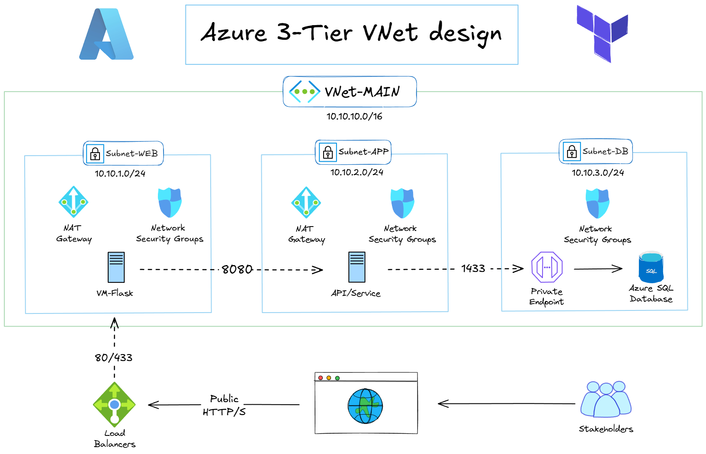
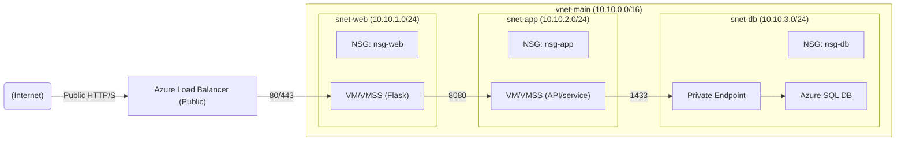
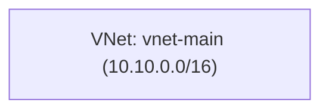
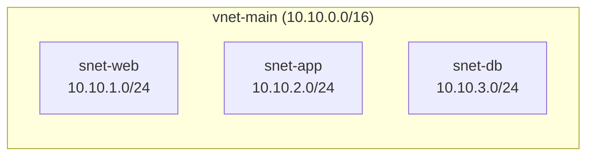
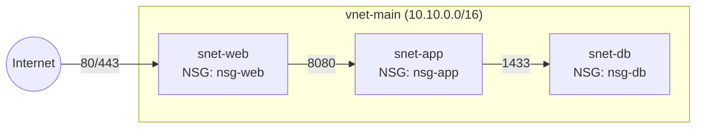
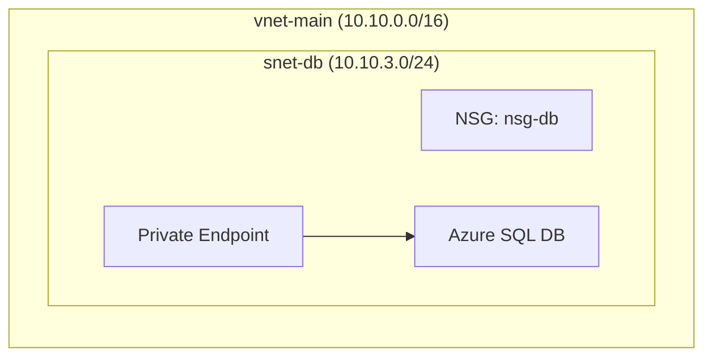
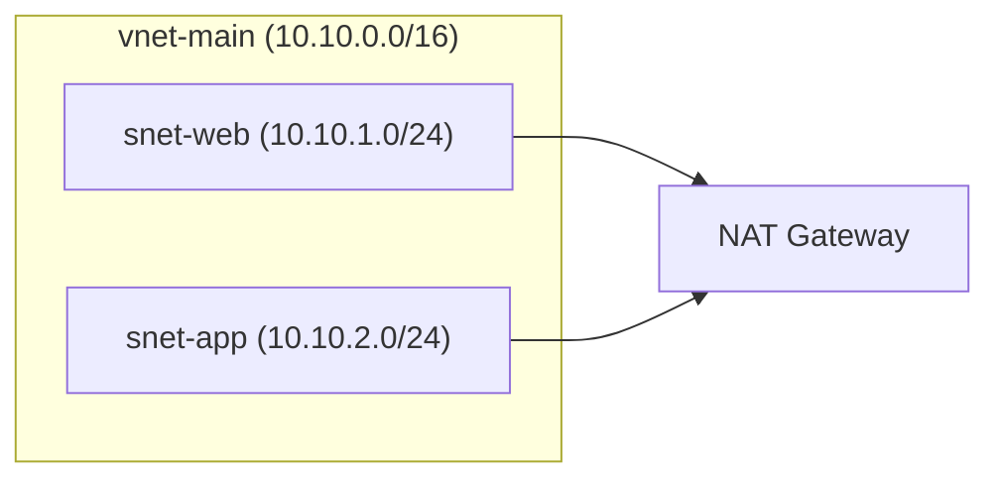
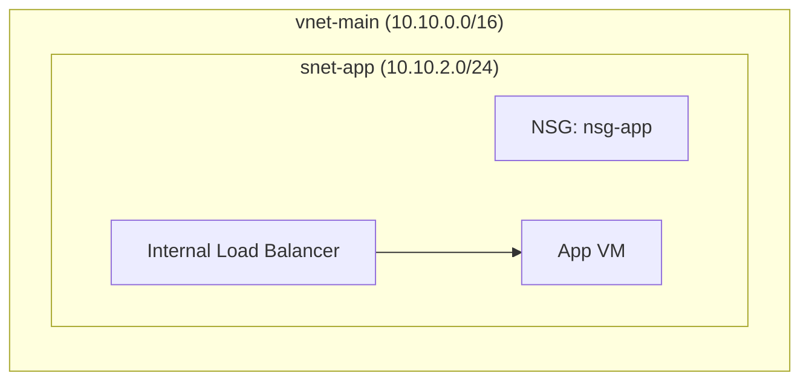
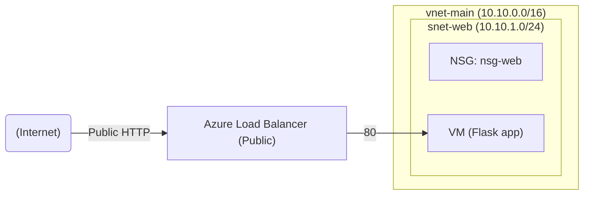
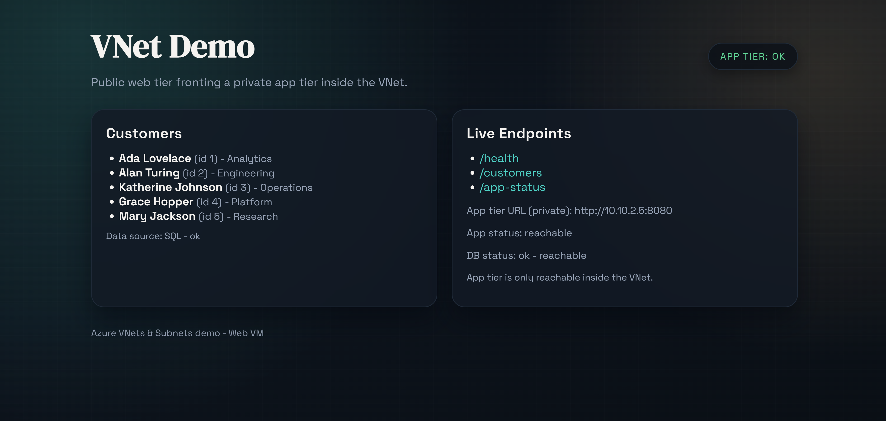

# Azure VNets & Subnets (IaC)

Terraform-first Azure networking project focusing on VNets, subnets, NSGs, and private connectivity. The repo is built one resource at a time to keep changes clear and repeatable.



## Introduction
This project builds a small, realistic Azure environment with a public web entry point, an internal app tier, and a private SQL database. Infrastructure is created in clear stages with Terraform, and helper scripts make it easy to deploy or tear down each layer.

The structure mirrors how real systems are typically laid out:
- Public traffic hits a load balancer, not the VM directly.
- Application services live on a private subnet behind an internal load balancer.
- Data stays private using a Private Endpoint, with outbound access provided by NAT.

Benefits of this approach (in simple terms):
- Clear separation between public, app, and data layers reduces risk and blast radius.
- Least-privilege network rules make it easier to reason about what can talk to what.
- Private data access avoids exposing databases to the public internet.
- Step-by-step Terraform keeps changes understandable and repeatable.

## Real-World Use Case
Production applications often need public entry, private data tiers, and tight network controls. This project mirrors that pattern with a public entry tier, application tier, and a private database tier connected via Private Endpoint.

## Quick Start
1) Install prerequisites:
   - Azure CLI (az)
   - Terraform (>= 1.5)
   - Python 3.10+
   - Microsoft sqlcmd (optional, for `--sql-init`)

2) Authenticate to Azure:
```powershell
az login
az account show
```

3) Deploy infrastructure:
```powershell
python scripts\deploy.py
```
At this stage the deploy script provisions the resource group, virtual network, subnets, NSGs, a private SQL database with Private Endpoint, a NAT gateway for outbound access, an internal app tier, a public load balancer, and a web VM running a simple Flask app.

## Architecture Overview (Target Design)


## Stage 1: VNet

A VNet is your private address space in Azure. It is the boundary where you define IP ranges and routing, like owning a small private network in the cloud. Everything else in the project lives inside this fenced area.


## Stage 2: Subnets

Subnets split the VNet into smaller zones. Think of them as rooms in a building where each room has a clear purpose (web, app, data). This makes traffic flows easier to reason about and lets you apply different policies to each zone.


## Stage 3: NSGs Attached

NSGs are the firewall rules for each subnet. They define who can talk to what and on which ports, so only expected flows are allowed. This keeps each layer protected even if another layer is compromised.


## Stage 4: Private SQL + Private Endpoint

A Private Endpoint gives Azure SQL a private IP inside the VNet. The app tier talks to the database over a private address instead of a public one. This keeps data access off the public internet while still using a managed service.


## Stage 5: NAT Gateway (Outbound)

NAT is the safe "exit door" for private VMs. It lets them reach the internet for updates and downloads, but it does not allow inbound connections. This is a common way to keep private subnets private while still functional.


## Stage 6: Internal App Tier

The app tier is intentionally internal. The internal load balancer provides a stable private address and a place to scale later, while keeping the app VM unreachable from the public internet. Only the web tier can reach it.


## Stage 7: Public LB + Web VM

The public load balancer is the only internet-facing component. It forwards traffic to the web VM on a private subnet, so the VM itself is never exposed. This gives you a clean, secure entry point for stakeholders.


The web VM lives in `snet-web` and only receives inbound traffic from the public load balancer. It has no public IP of its own.
It serves a simple landing page at `/` plus `/customers` and `/app-status`. The customer list is fetched from the app tier (SQL-backed) when available.



## Resource Naming
Resources use a prefix plus a random pet suffix for uniqueness, for example:
`rg-vnet-brave-otter`
`vnet-main-brave-otter`
`snet-web-brave-otter`
`nsg-web-brave-otter`
`lb-public-brave-otter`
`pip-lb-brave-otter`
`vm-web-brave-otter`
Set `resource_group_name` in `terraform/01_resource_group/terraform.tfvars` or update defaults in `scripts/deploy.py` to override.

## Project Structure
- `terraform/01_resource_group`: Azure resource group
- `terraform/02_vnet`: Virtual network
- `terraform/03_subnets`: Subnets
- `terraform/04_nsg`: Network security groups + rules + subnet associations
- `terraform/05_private_sql`: SQL server + database + private endpoint + private DNS
- `terraform/06_nat_gateway`: NAT gateway + outbound IP
- `terraform/07_app_tier`: Internal load balancer + app VM
- `terraform/08_load_balancer`: Public load balancer + health probe + rule
- `terraform/09_compute_web`: Web VM + NIC + cloud-init app
- `scripts/`: Deploy/destroy helpers (auto-writes terraform.tfvars)
- `sql_scripts/`: SQL seed script for the demo database
- `guides/setup.md`: Detailed setup guide

Example variables files:
- `terraform/01_resource_group/terraform.tfvars.example`
- `terraform/02_vnet/terraform.tfvars.example`
- `terraform/03_subnets/terraform.tfvars.example`
- `terraform/04_nsg/terraform.tfvars.example`
- `terraform/05_private_sql/terraform.tfvars.example`
- `terraform/06_nat_gateway/terraform.tfvars.example`
- `terraform/07_app_tier/terraform.tfvars.example`
- `terraform/08_load_balancer/terraform.tfvars.example`
- `terraform/09_compute_web/terraform.tfvars.example`

## Deploy/Destroy Options
Deploy:
```powershell
python scripts\deploy.py
python scripts\deploy.py --rg-only
python scripts\deploy.py --vnet-only
python scripts\deploy.py --subnets-only
python scripts\deploy.py --nsg-only
python scripts\deploy.py --sql-only
python scripts\deploy.py --nat-only
python scripts\deploy.py --app-only
python scripts\deploy.py --lb-only
python scripts\deploy.py --compute-only
```
Seed the SQL demo table (requires `sqlcmd` and SQL public access or IP allow):
```powershell
python scripts\deploy.py --sql-init
```
Seed the SQL demo table via the private endpoint (runs on the app VM):
```powershell
powershell -ExecutionPolicy Bypass -File scripts\seed_sql.ps1
```

Destroy:
```powershell
python scripts\destroy.py
python scripts\destroy.py --rg-only
python scripts\destroy.py --vnet-only
python scripts\destroy.py --subnets-only
python scripts\destroy.py --nsg-only
python scripts\destroy.py --sql-only
python scripts\destroy.py --nat-only
python scripts\destroy.py --app-only
python scripts\destroy.py --lb-only
python scripts\destroy.py --compute-only
```

## Post-Deploy Checks
Quick status checks for the running environment (PowerShell):
```powershell
powershell -ExecutionPolicy Bypass -File scripts\health_check.ps1
```
Combined tests (PowerShell, health checks by default, plus optional SQL seed):
```powershell
powershell -ExecutionPolicy Bypass -File scripts\tests.ps1
powershell -ExecutionPolicy Bypass -File scripts\tests.ps1 -SeedSql
```

## Guide
See `guides/setup.md` for detailed instructions.
