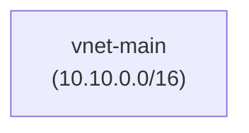
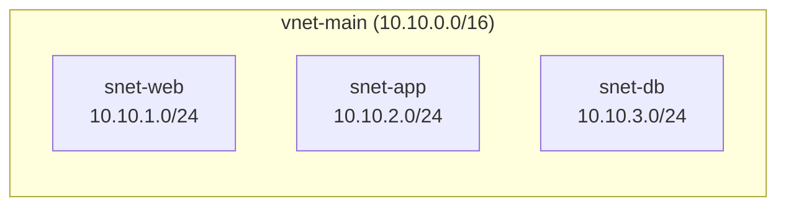
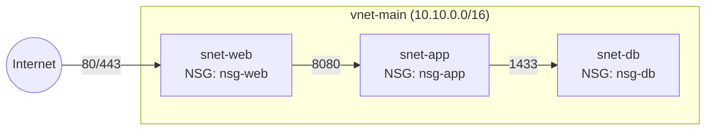
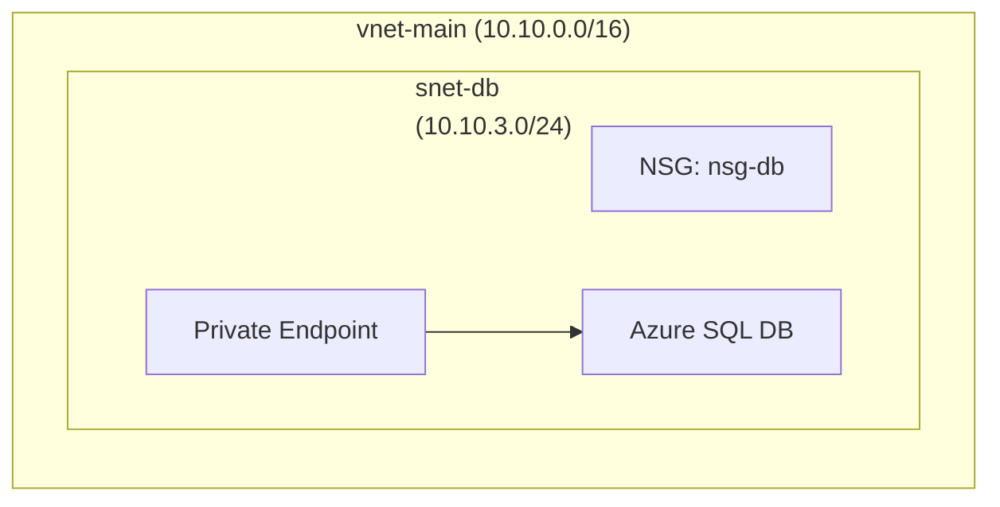
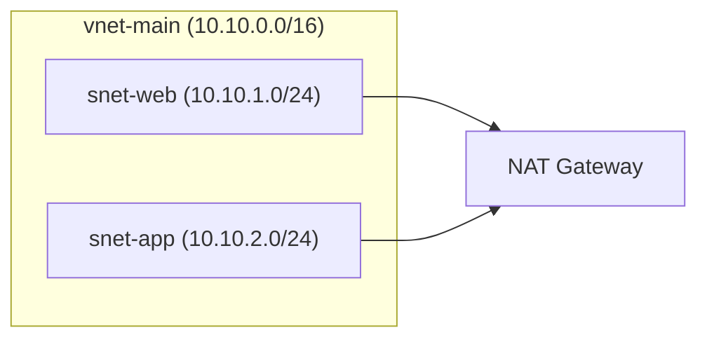
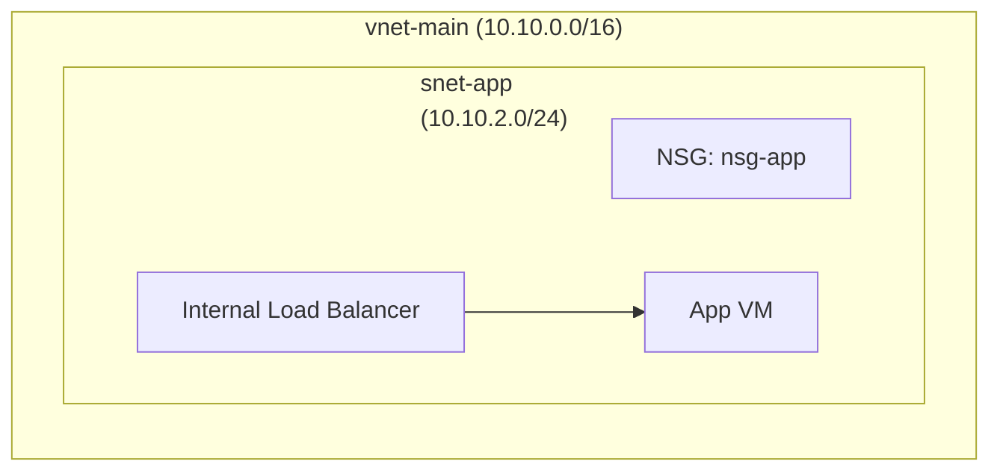
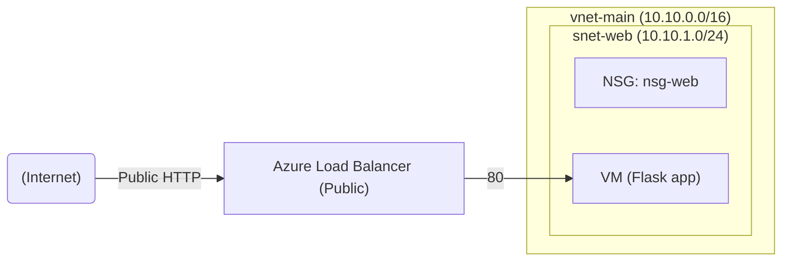

# Project Setup Guide

This project provisions Azure networking resources using Terraform and includes helper scripts.

## Prerequisites
- Azure CLI (az) installed and authenticated
- Terraform installed (>= 1.5)
- Python 3.10+ (for running the helper scripts)
- Microsoft sqlcmd (optional, for `--sql-init`)

## Azure CLI
Check your Azure CLI and login status:

```powershell
az --version
az login
az account show
```

If you need to switch subscriptions:

```powershell
az account list --output table
az account set --subscription "<subscription-id-or-name>"
az account show
```

## Terraform Setup
Check if Terraform is installed and on PATH:

```powershell
terraform version
```

Install or update Terraform on Windows:

```powershell
winget install HashiCorp.Terraform
```

```powershell
choco install terraform -y
```

After installing, re-open PowerShell and re-run terraform version.

## Project Structure
- `terraform/01_resource_group`: Azure resource group
- `terraform/02_vnet`: Virtual network
- `terraform/03_subnets`: Subnets
- `terraform/04_nsg`: Network security groups + rules + subnet associations
- `terraform/05_private_sql`: SQL server + database + private endpoint + private DNS
- `terraform/06_nat_gateway`: NAT gateway + outbound IP
- `terraform/07_app_tier`: Internal load balancer + app VM
- `terraform/08_load_balancer`: Public load balancer + health probe + rule
- `terraform/09_compute_web`: Web VM + NIC + cloud-init app
- `scripts/`: Helper scripts to deploy/destroy Terraform resources
- `sql_scripts/`: SQL seed script for the demo database
- `guides/setup.md`: This guide

## Configure Terraform
The deploy script writes `terraform/01_resource_group/terraform.tfvars` and
`terraform/02_vnet/terraform.tfvars` plus `terraform/03_subnets/terraform.tfvars` and
`terraform/05_private_sql/terraform.tfvars` plus `terraform/06_nat_gateway/terraform.tfvars` and
`terraform/07_app_tier/terraform.tfvars` automatically, along with later stacks.
If you want different defaults, edit `DEFAULTS` in `scripts/deploy.py` or set environment variables.

Supported environment variables:
- `RESOURCE_GROUP_NAME`
- `RESOURCE_GROUP_NAME_PREFIX`
- `LOCATION`
- `VNET_NAME`
- `VNET_NAME_PREFIX`
- `VNET_ADDRESS_SPACE`
- `SUBNET_NAME_PREFIX`
- `SUBNET_NAME_SUFFIX`
- `SUBNET_WEB_CIDR`
- `SUBNET_APP_CIDR`
- `SUBNET_DB_CIDR`
- `NSG_NAME_PREFIX`
- `SQL_SERVER_NAME`
- `SQL_SERVER_NAME_PREFIX`
- `SQL_ADMIN_LOGIN`
- `SQL_ADMIN_PASSWORD`
- `AZUREAD_ADMIN_LOGIN`
- `AZUREAD_ADMIN_OBJECT_ID`
- `SQL_DATABASE_NAME`
- `SQL_DATABASE_SKU_NAME`
- `SQL_MAX_SIZE_GB`
- `SQL_MIN_CAPACITY`
- `SQL_AUTO_PAUSE_DELAY_IN_MINUTES`
- `SQL_PUBLIC_NETWORK_ACCESS_ENABLED`
- `SQL_ZONE_REDUNDANT`
- `SQL_ALLOW_AZURE_SERVICES`
- `SQL_CLIENT_IP_ADDRESS`
- `SQL_PRIVATE_DNS_ZONE_NAME`
- `SQL_PRIVATE_ENDPOINT_NAME_PREFIX`
- `SQL_PRIVATE_DNS_ZONE_LINK_NAME_PREFIX`
- `SQL_PRIVATE_DNS_ZONE_GROUP_NAME`
- `SQL_SUBNET_KEY`
- `NAT_GATEWAY_NAME`
- `NAT_GATEWAY_NAME_PREFIX`
- `NAT_PUBLIC_IP_NAME`
- `NAT_PUBLIC_IP_NAME_PREFIX`
- `NAT_PUBLIC_IP_SKU`
- `NAT_GATEWAY_SKU`
- `NAT_IDLE_TIMEOUT_IN_MINUTES`
- `NAT_SUBNET_KEYS`
- `APP_LB_NAME`
- `APP_LB_NAME_PREFIX`
- `APP_LB_SKU`
- `APP_PORT`
- `APP_PROBE_PATH`
- `APP_VM_NAME`
- `APP_VM_NAME_PREFIX`
- `APP_NIC_NAME_PREFIX`
- `APP_VM_SIZE`
- `APP_VM_ADMIN_USERNAME`
- `APP_VM_ADMIN_PASSWORD`
- `APP_SUBNET_KEY`
- `APP_TIER_URL`
- `LB_NAME`
- `LB_NAME_PREFIX`
- `PUBLIC_IP_NAME`
- `PUBLIC_IP_NAME_PREFIX`
- `LB_SKU`
- `PUBLIC_IP_SKU`
- `LB_FRONTEND_PORT`
- `LB_BACKEND_PORT`
- `LB_PROBE_PATH`
- `VM_NAME`
- `VM_NAME_PREFIX`
- `NIC_NAME_PREFIX`
- `VM_SIZE`
- `VM_ADMIN_USERNAME`
- `VM_ADMIN_PASSWORD`
- `TAG_PROJECT`
- `TAG_ENV`
- `TAG_OWNER`

Example variables file:
- `terraform/01_resource_group/terraform.tfvars.example`
- `terraform/02_vnet/terraform.tfvars.example`
- `terraform/03_subnets/terraform.tfvars.example`
- `terraform/04_nsg/terraform.tfvars.example`
- `terraform/05_private_sql/terraform.tfvars.example`
- `terraform/06_nat_gateway/terraform.tfvars.example`
- `terraform/07_app_tier/terraform.tfvars.example`
- `terraform/08_load_balancer/terraform.tfvars.example`
- `terraform/09_compute_web/terraform.tfvars.example`

## Deploy Resources
From the repo root:

```powershell
python scripts\deploy.py
```

Optional flags:

```powershell
python scripts\deploy.py --rg-only
python scripts\deploy.py --vnet-only
python scripts\deploy.py --subnets-only
python scripts\deploy.py --nsg-only
python scripts\deploy.py --sql-only
python scripts\deploy.py --nat-only
python scripts\deploy.py --app-only
python scripts\deploy.py --lb-only
python scripts\deploy.py --compute-only
```
Seed the SQL demo table (requires `sqlcmd` and SQL public access or IP allow):
```powershell
python scripts\deploy.py --sql-init
```
Seed the SQL demo table via the private endpoint (runs on the app VM):
```powershell
powershell -ExecutionPolicy Bypass -File scripts\seed_sql.ps1
```

## Destroy Resources
To tear down resources:

```powershell
python scripts\destroy.py
```

Optional flags:

```powershell
python scripts\destroy.py --rg-only
python scripts\destroy.py --vnet-only
python scripts\destroy.py --subnets-only
python scripts\destroy.py --nsg-only
python scripts\destroy.py --sql-only
python scripts\destroy.py --nat-only
python scripts\destroy.py --app-only
python scripts\destroy.py --lb-only
python scripts\destroy.py --compute-only
```

## Post-Deploy Checks
Quick status checks for the running environment (PowerShell):
```powershell
powershell -ExecutionPolicy Bypass -File scripts\health_check.ps1
```
Combined tests (PowerShell, health checks by default, plus optional SQL seed):
```powershell
powershell -ExecutionPolicy Bypass -File scripts\tests.ps1
powershell -ExecutionPolicy Bypass -File scripts\tests.ps1 -SeedSql
```

## Notes
- If you run Terraform directly in a module (not via the scripts), run `terraform init` first to create/update the provider lock file.
- Resource names are built from a prefix plus a random pet suffix.
- Terraform state and tfvars files are gitignored by default.
- The web VM runs a small Flask app on port 80 with `/`, `/health`, `/customers`, and `/app-status` endpoints. The customer list is sourced from the app tier when configured.
- `python scripts\deploy.py --sql-init` requires Microsoft `sqlcmd` and SQL public access (or a firewall IP allow).
 - `scripts/seed_sql.ps1` uses the app VM to reach the private SQL endpoint.
- If `AZUREAD_ADMIN_LOGIN` is not set, the deploy script uses the signed-in Azure CLI user for the SQL Entra admin.
- The SQL seed script lives at `sql_scripts/vnet_demo_seed.sql`.
- The NAT gateway stage enables outbound package installs for private VMs without public IPs.

## Stage 1: VNet


## Stage 2: Subnets


## Stage 3: NSGs Attached


## Stage 4: Private SQL + Private Endpoint


## Stage 5: NAT Gateway (Outbound)


## Stage 6: Internal App Tier


## Stage 7: Public LB + Web VM


The web VM lives in `snet-web` and only receives inbound traffic from the public load balancer. It has no public IP of its own.
